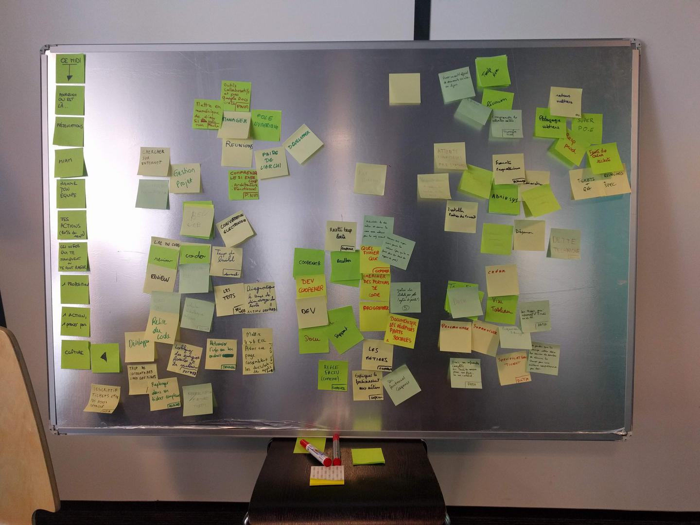

# Proposition

Sonia s'interroge sur les dynamiques de documentation des différentes équipes. Elle sait que Thomas participe à l'organisation de [Write the Docs Paris][] le lendemain.

Thomas sent que l'information ne circule pas aussi facilement qu'elle ne devrait, qu'il y a peut-être des tensions et donc des bouchons dans cette circulation. Au lieu de parler de documentation, Thomas part sur un format participatif d'où peut-être émergera la documentation, et d'autres choses.

L'envie est que les participant·es repartent avec des actions à planifier au prochain backlog de leur équipe (mais il le verbalise comme ça un peu plus tard dans le processus).

# Déroulé

1. Pourquoi on est là Contexte sur la présence de Thomas, présentation du déroulé ;
2. Présentation croisée Chacun·e à son tour, je présente la personne qui se trouve à ma droite ;
3. Déjeuner ;
4. Nomme ton équipe Chaque personne écrit sur un post-it le nom qu'ielle donne à son équipe ;
5. Les actions qui prennent 80% de mon temps de travail Une action par post-it, placées autour du nom de son équipe ;
6. Les infos qui te manquent/trucs qui te font rager ;
7. Une action à placer au backlog Maintenant qu'on a parlé de sujets qui grattent, quel premier pas proposes-tu de mettre au backlog de ton équipe pour avancer dans une direction du "mieux" ?
8. Clôture

# Nomme ton équipe

Les noms qui ressortent de l'exercice sont les suivants :

- Pôle numérique
- Dev Web
- Responsable prod / Super PO·E
- Transfo Num (Transformation Numérique)
- Dev Coopener
- Data
- Admin sys

# Ce qui occupe 80% de mon temps de travail

- Pôle numérique
  - Manager
  - Réunions
  - Pairer avec l'archi
  - Développer
- Dev Web
  - Gestion de projet
  - Chercher sur Internet
  - Conversations électroniques
  - Coder
  - Review
  - Lire du code / Relire du code
  - Développement
  - Normalisation de l'écriture des tickets
- Transfo Num (Transformation Numérique)
  - Réunions
  - (post-it vierge)
  - (post-it bleu que je n'arrive pas à lire)
- Dev Coopener
  - Documentation
  - Support
  - Recettes
  - Programmer
  - Chercher des portions de code
- Data
  - Programmer / Déboguer
  - Superviser
  - Créer
  - Visualiser des tableaux
- Admin sys
  - Installer des postes de travail
  - Dépanner
  - Administrer
  - (2 ou 3 autres post-its que je n'arrive pas à lire)
- Responsable prod / Super PO·E
  - Pédagogie avec les métiers
  - Tickets + QA
  - Réunions + Specs

# Les infos qui me manquent / trucs qui me font rager

- Pôle numérique
  - Comprendre le SI Enercoop (architecture, fonctionnel)
  - Les outils collaboratifs et pas des Google Docs pirates
- Dev Web
  - Temps de build
  - Les tests
  - Retrouver l'info au bon endroit
  - Lobbying des énergies fossiles et du nucléaire
  - Descriptif des tickets pas assez détaillé
  - Trop de commentaires dans les tickets
  - Replonger dans un ticket complexe
  - Utilisation de bibliothèques externes
- Transfo Num (Transformation Numérique)
  - Comprendre les attentes des métiers
- Dev Coopener
  - Expliquer le fonctionnement aux métiers
  - Règles de facturation (complexes)
  - Quel fichier Qu????
  - Recette trop lente
  - Les métiers
- Data
  - Avoir une information complète (ex : toutes les sources pour un flux, ou un contact)
  - Spécification ticket
  - Les bugs qui viennent d'Enedis ou des RE
- Admin sys
  - Formats propriétaires
  - Attente des fournisseurs / prestataires
  - Dette technique
- Responsable prod / Super PO·E
  - Les retours métiers

# Une action à placer au prochain backlog

- Pôle numérique
  - Mettre en numérique le diagramme SI qui est sur mon mur (effort : 1)
- Dev Web
  - Diagnostiquer le temps de démarrage des tests (effort : 2)
  - Avoir une page rassemblant les docs/wiki des applis
- Transfo Num (Transformation Numérique)
  - Avoir un outil officiel de documents éditables en ligne
- Dev Coopener
  - Documenter les récipicés de parts sociales (effort : 1)
  - Gestion des tickets par système de points (effort : 5)
  - Nommer des super users par métier (pour qu'on ne fasse plus du tout le support de prod)
  - Actualiser la doc métier et donner la main pour la mise à jour
- Data
  - Ne garder que les champs utiles dans les sources de données et décrire les champs pour une meilleure compréhension par tou·te·s
- Admin sys
- Responsable prod / Super PO·E

# Clôture

(une partie de l'équipe est partie car réunion à 14h)

- c'était chouette de passer 2h tou·te·s ensemble (c'est rare) ;
- documentation : mais qui les fait au final ? Parce qu'on a jamais le temps, et ce n'est jamais priorisé ;
- ça permet de voir les convergences, pour les métiers, pour les dev ;
- vision des difficultés, ce que sont les choses pour les autres équipes (et où créer des convergences)
- on a créé une vision ensemble, un temps commun — sur des sujets jamais prioritaires… à refaire en plus petits groupes pour avancer ?
- on est allé plus loin que d'habitude, mais les points sont déjà connus
- quid de qui fait, qui est responsabilisé (on ne fait pas car on n'a pas de temps en commun ?)
- on voit les les constats qu'on avait dans chaque équipe… mais là ils sont partagés avec les autres équipes

[Write the Docs Paris]: https://www.meetup.com/Write-the-Docs-Paris/events/260964602/
